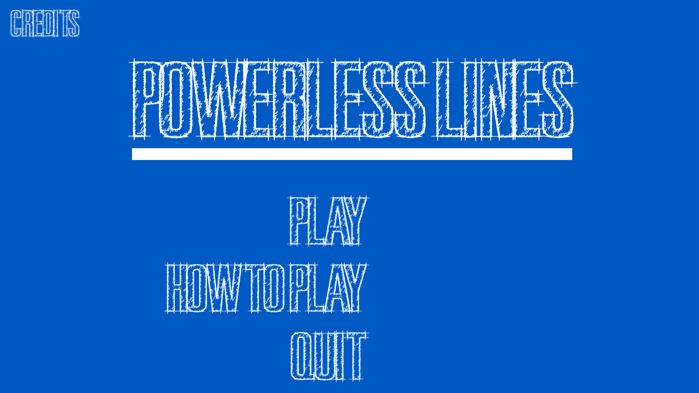
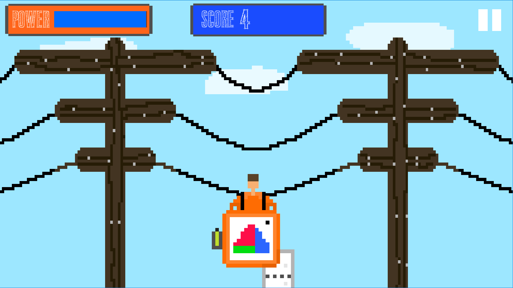
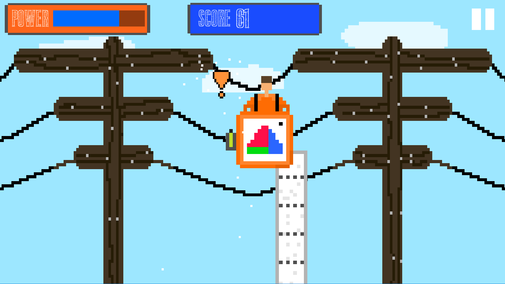

# Powerless Lines

### Description
"Powerless Lines" was created for Ludum Dare Game Jam 39 under the theme "Running out of Power." In this game by **Empowered Pixel**, you assume the role of a construction worker tasked with resolving various sparks and issues occurring along power lines.

### Gameplay
As a construction worker, you must navigate the screen and address different sparks and problems that are threatening the stability of the power lines. Move swiftly and strategically to fix these issues before the power runs out completely.

### Features
- **Electrifying Challenges**: Address sparks and problems along power lines.
- **Construction Worker Simulation**: Experience the role of a worker in the field.
- **Time-Sensitive Fixes**: Act swiftly to prevent a power outage.

### Gameplay Screenshots

### How to Play
1. **Game Jam Entry**: Access the game's entry on the [Ludum Dare Game Jam](https://ldjam.com/events/ludum-dare/39/powerless-lines).
2. **Download**: Clone or download the repository.
3. **Run the Game**: Open the project in Unity and launch the game.
4. **Fix the Power Lines**: Move around the screen to address sparks and issues.
5. **Prevent the Outage**: Complete repairs before the power runs out.

### Credits
- Developed by Jonathan McLatcher (Empowered Pixel)
- Created for Ludum Dare Game Jam 39 ([Ludum Dare](https://ldjam.com/))
- Date: July 2017
- Theme: Running out of Power

### License
This project is licensed under MIT License
